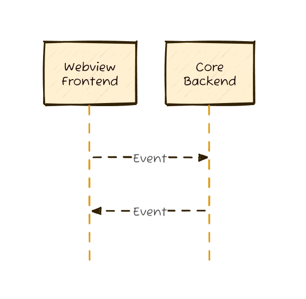

# tauri中rust和前端的相互调用（rust后端调用前端）

## 前言

近期Tauri 2.0 rc版本发布，2.0版本迎来第一个稳定版本，同时官方文档也进行了更新。Tauri是一个使用Rust构建的框架，可以让你使用前端技术来构建桌面应用程序。

在先前的开发工作中，由于Tauri本身有整合浏览器的能力，有相当多的部分是在前端能力的基础上实现的，比如说web serial api,又或者web camera api,这些api在前端中调用是相当容易的，但是容易使用并不代表它就一定是可靠的，比如web serial api的断帧问题就无解，即使你写循环去补，也会出现错帧的情况，对于小数据来说已经完全够用了（30个字节以下），对于数据量稍微多一点，就要分帧处理，且很混乱。所以，对于这种东西，最好也就是使用rust来实现了。当然，tauri也并不是一直都好的，tauri官方做出一堆插件，这些插件很容易就可以使用，相当于用户只需要关心前端开发，但是这些插件有些使用的谷歌服务，谷歌服务在国内无法访问，所以体验也不好。这也不好，那也不好，究竟怎么才能行呢？期待tauri以后能解决这些问题，起码就目前而言，调用rust能力是个比较靠谱一点的方案，可惜东西需要自己写。

吐槽完毕，开始进入正题。

在使用tauri进行开发时，前后端通信是相当重要的，可以说是贯穿应用开发的整个流程，所以，在此之前，你需要了解tauri前后端是如何通信的。官方在更新了v2的文档后，提供了如下图片，很清晰，轻松就能看懂。



从图上可以看出，tauri的事件是可以双向传递的，这就对前后端通信很有帮助，一旦你理解了这个图，tauri开发你就懂了一大半了。

## rust中调用前端
根据前面图中的描述，我们可以知道，要想在rust中调用前端的方法，要在rust中向前端发送一个事件，前端监听这个事件，当前端监听到这个事件后，前端就可以进行相应的处理，这样就实现了rust调用前端的功能。

要实现这些功能，那么就需要解决以下问题：

1. 如何向前端发送事件
2. 前端如何监听事件

我们来挨个解决这些问题。

### 如何向前端发送事件
向前端发送事件的能力是由AppHandle来提供的，AppHandle是tauri的核心，它提供了很多能力，包括前后端通信，窗口管理，应用生命周期管理等等。所以，要向前端发送事件，就需要先获取到AppHandle。

获取AppHandle的方式很简单，不需要我们手动来加很多东西，只要在command中添加参数，在程序执行的时候会自动注入AppHandle，然后我们就可以直接使用AppHandle了。

在获取到AppHandle后，可以调用emit方法来触发前端事件，emit方法接受两个参数，第一个参数是事件名，第二个参数是事件数据，事件数据可以是任意类型，tauri会自动将数据转换为前端可以识别的数据类型。

以下是示例代码
```rust
#[tauri::command]
fn send_event(app_handle: tauri::AppHandle, message: String) {
    app_handle.emit("rust_event", message).unwrap();
}
```


> 事件负载数据最好使用struct,因为官方就是这么做的，struct支持序列化，且代码美观，易读懂。
> ```rust
> #[derive(Clone, Serialize)]
> #[serde(rename_all = "camelCase")]
> struct DownloadStarted<'a> {
>   url: &'a str,
>   download_id: usize,
>   content_length: usize,
> }
> ```

在这里有一点是要注意的，也是可能你很需要的，就是触发事件分为

1. 触发全局事件
2. 触发指定Webview的事件

上述给的例子就是触发全局事件，你只要在webview中监听这个事件，就可以触发这个事件，如果你想要指定，那么要使用`emit_to`方法，这个方法接受三个参数，第一个参数是事件名，第二个参数是webview的id，第三个参数是事件数据，webview的id可以通过`tauri::Window`来获取，`tauri::Window`可以通过`tauri::WindowBuilder`来创建，`tauri::WindowBuilder`可以通过`tauri::Builder`来创建，`tauri::Builder`可以通过`tauri::Builder::default()`来创建。

以下是示例代码
```rust
use tauri::{AppHandle, Emitter};

#[tauri::command]
fn login(app: AppHandle, user: String, password: String) {
  let authenticated = user == "tauri-apps" && password == "tauri";
  let result = if authenticated { "loggedIn" } else { "invalidCredentials" };
  app.emit_to("login", "login-result", result).unwrap();
}
```

```rust
use tauri::{Emitter, EventTarget};

#[tauri::command]
fn download(app: tauri::AppHandle) {
  for i in 1..100 {
    std::thread::sleep(std::time::Duration::from_millis(150));
    // emit a download progress event to all listeners
    app.emit_to(EventTarget::any(), "download-progress", i);
    // emit an event to listeners that used App::listen or AppHandle::listen
    app.emit_to(EventTarget::app(), "download-progress", i);
    // emit an event to any webview/window/webviewWindow matching the given label
    app.emit_to("updater", "download-progress", i); // similar to using EventTarget::labeled
    app.emit_to(EventTarget::labeled("updater"), "download-progress", i);
    // emit an event to listeners that used WebviewWindow::listen
    app.emit_to(EventTarget::webview_window("updater"), "download-progress", i);
  }
}
```

或者使用` emit_filter`来指定
```rust
use tauri::{Emitter, EventTarget};

#[tauri::command]
fn download(app: tauri::AppHandle) {
  for i in 1..100 {
    std::thread::sleep(std::time::Duration::from_millis(150));
    // emit a download progress event to the updater window
    app.emit_filter("download-progress", i, |t| match t {
      EventTarget::WebviewWindow { label } => label == "main",
      _ => false,
    });
  }
}
```

> 指定窗口label需要创建多个窗口，这个目前还未涉及到，后面更新文章添加相关管内容（多窗口管理）。

## 前端监听事件
在tauri中前端监听事件是非常容易的，tauri导出了一个listen对象，可以监听事件，在使用的时候绑定你所需要的方法就好了。

以下是示例代码（监听全局事件）
```ts
import { listen } from '@tauri-apps/api/event';

type DownloadStarted = {
  url: string;
  downloadId: number;
  contentLength: number;
};

listen<DownloadStarted>('download-started', (event) => {
  console.log(
    `downloading ${event.payload.contentLength} bytes from ${event.payload.url}`
  );
});
```

监听指定webview的事件
```ts
import { getCurrentWebviewWindow } from '@tauri-apps/api/webviewWindow';

const appWebview = getCurrentWebviewWindow();
appWebview.listen<string>('logged-in', (event) => {
  localStorage.setItem('session-token', event.payload);
});
```

监听事件这个对象会在应用的整个生命周期监听事件，如果需要不监听了，那么你可以接受监听事件的返回值，执行

```ts
import { listen } from '@tauri-apps/api/event';

const unlisten = await listen('download-started', (event) => {});
unlisten();
```

如果监听的事件只需要执行一次，那么只需要调用`once`方法即可

```ts
import { once } from '@tauri-apps/api/event';
import { getCurrentWebviewWindow } from '@tauri-apps/api/webviewWindow';

once('ready', (event) => {});

const appWebview = getCurrentWebviewWindow();
appWebview.once('ready', () => {});
```

> 后续还有通道`channel`，支持大数据传输，这个目前还未涉及到，也没有找到应用场景，如果遇到了我会写一下这里的坑。

## 执行js代码

既然是webview,肯定少不了执行js代码的部分（很期待能控制网络请求，那可就太爽了），通过这个，一些网页自动化插件什么的，很轻松就能实现了，我觉得后面可以做个玩玩。

以下是示例代码
```rust
use tauri::Manager;

tauri::Builder::default()
  .setup(|app| {
    let webview = app.get_webview_window("main").unwrap();
    webview.eval("console.log('hello from Rust')")?;
    Ok(())
  })
```

> 前端调用rust可以使用command,也可以使用event,这个内容放到下期。