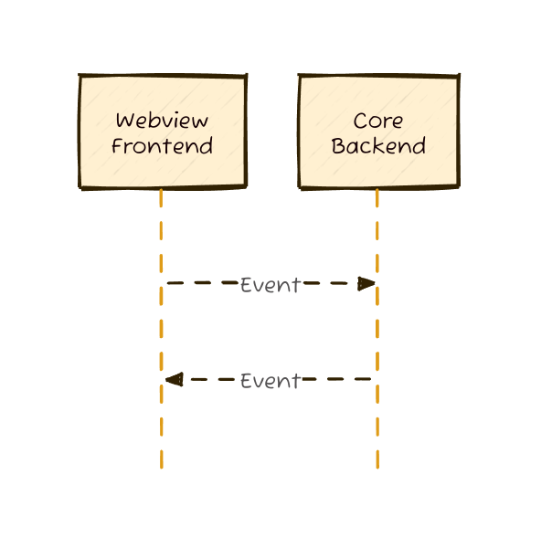

# 第36周-tauri中rust和前端的相互调用（前端调用rust）
## 前言

本期将继续接着上一期，继续探索tauri中rust和前端的相互调用，上一期我们介绍了rust调用前端，这一期我们继续探索前端调用rust。

首先还是回忆一下上周tauri的前后端通信示意图



从该图片我们可以清晰的看出来，tauri的前端和rust后端通信是通过事件机制来实现的，在上期中，我介绍了事件机制的基础，以及如何通过rust的工具来调用前端的方法，也就是触发前端监听的事件。

这张图是双向的，也就是说前端也可以触发rust监听的事件，这样前端也可以调用rust的方法，这也是本期的主要内容。

除此以外，tauri官方推荐的前端调用rust后端的主要方法是通过`command`来调用，因此，如果你要做的东西比较简单，那么更建议使用`command`来调用，因为`command`的调用方式更简单，更符合前端开发者的习惯，而且选择合适的使用场景的能力对于一个开发人员来说也是非常重要的。


从图上可以看出，tauri的`command`其实与`fetch api`是非常相似的，都是请求、响应的模式，但其实这个机制是使用json-rpc来实现的（这些都是官方写的），不过这个不需要深究，除非你是老专家。我们只需要知道怎么用的，置于原理那是后面的事情，如果tauri可以活到那个时候的话。

以上是tauri使用`command`来与rust后端通信的流程图。其中一些转换方法tauri已经为我们实现了，当你理解了这张图，在使用`command`时就会非常简单。

> Because this mechanism uses a JSON-RPC like protocol under the hood to serialize requests and responses, all arguments and return data must be serializable to JSON.

> **注意**：本文内容均可在`官方文档`中找到对应内容： https://v2.tauri.app/concept/inter-process-communication/

## 1. 前端调用rust（command）

为了更加方便的描述tauri是如何从前端调用rust的，我先写一个流程，然后以这个流程来逐步实现该功能。

1. 在rust后端定义一个`command`
2. 注册`command`
3. 前端调用`command`

### 1. 在后端定义一个`command`

在rust中，`command`的定义非常简单，只需要在`src-tauri/src/main.rs`中定义一个函数，并使用`tauri::command!`宏来标记该函数为`command`即可，就像程序自带的`command`，greet就是这么做的（学习就是在看例子）。

```rust
#[tauri::command]
fn greet(name: &str) -> String {
    format!("Hello, {}! You've been greeted from Rust!", name)
}
```

在这个greet的例子中，可以看到，name是需要传入的参数，然后返回一个格式化的字符串。（不写分号等于返回，不需要写return）
那么在这里需要注意的是参数，也就是tauri如何接受参数，根据官方文档，传入参数可以是任意类型，但是前提是这个类型必须实现`serde::Deserialize`。

**注意**：参数是可以重命名的，类似于后端开发中的dto,但是需要使用`#[tauri::command(rename_all = "snake_case")]`来标记，否则tauri会报错。这样前端就可以传入与后端参数名一样了。

返回值必须是String，因为要序列化（其实**可以返回任何类型**，但是你的类型必须实现`serde::Serialize`，如果是传入参数，那么必须实现`serde::Deserialize`，个人建议这两个序列化和反序列化的特征全部实现，就不用考虑那么多了，如果你比较仔细，就可以在这仔细看看）。

初次以外还可以返回数组buffer,可以用（tauri::ipc::Response），错误处理也可使用Result，本文章不可能做到面面俱到，读者应学会看官方文档，当然在后续文章中我应该也是会补上的。

> **注意**:
> 1. 其实你也可以把`command`放在`lib.rs`，拆分开这样代码才会更加条理。
> 2. `command`是唯一的，不允许重复，也就是说，你得注意命名规范，避免重复。

### 2. 注册`command`

在定义完`command`之后，我们需要将`command`注册到tauri中，这样tauri才能知道我们定义了哪些`command`，前端才能调用这些`command`。

在`src-tauri/src/main.rs`中，我们可以看到`tauri::Builder`的实例，我们可以在这个实例上调用`invoke_handler`方法来注册`command`。

```rust
tauri::Builder::default()
    .invoke_handler(tauri::generate_handler![greet])
```

这是官方案例中的greet方法，我们只需要学习其使用方法就可以了，可以直接跟在greet后面（那是个数组），或者替换也没关系，就像下面这样

```rust
tauri::Builder::default()
    .invoke_handler(tauri::generate_handler![greet, another_command])
```
这样就可以注册多个`command`了。

### 3. 前端调用`command`

在tauri 2.0中，tauri导出了invoke方法，因此我们导入该方法以后调用即可。

```ts
// 导入 invoke 方法
import { invoke } from '@tauri-apps/api/core';

// ...
invoke('my_custom_command'); //调用 command
```

> **注意**：tauri官方推荐使用异步command,但是经我自己测试是有问题的，异步command执行不了异步方法（笑死）。


## 2. 前端调用rust（event）

使用事件来进行通信与上期内容是差不多的。在前端中，tauri导出了`emit`方法，我们导入这个方法就可以触发rust中的监听器。

```ts
// 导入 emit 方法
import { emit } from '@tauri-apps/api/event';

// ...
emit('my_custom_event', payload); //触发事件
```

其中，`payload`是传递给rust的参数，是个对象。

然后在rust中监听这个事件

```rust
use tauri::Listener;

#[cfg_attr(mobile, tauri::mobile_entry_point)]
pub fn run() {
  tauri::Builder::default()
    .setup(|app| {
      app.listen("my_custom_event", |event| {
        if let Ok(payload) = serde_json::from_str::<DownloadStarted>(&event.data) {
          println!("downloading {}", payload.url);
        }
      });
      Ok(())
    })
    .run(tauri::generate_context!())
    .expect("error while running tauri application");
}
```

> **注意**:你甚至可以用前端监听事件，触发事件，简直非常好用。

发挥你的想象力，如果你想要监听指定webview的事件，那么也是可以实现的

```rust
use tauri::{Listener, Manager};

#[cfg_attr(mobile, tauri::mobile_entry_point)]
pub fn run() {
  tauri::Builder::default()
    .setup(|app| {
      let webview = app.get_webview_window("main").unwrap();
      webview.listen("logged-in", |event| {
        let session_token = event.data;
        // save token..
      });
      Ok(())
    })
    .run(tauri::generate_context!())
    .expect("error while running tauri application");
}
```
> 官方文档内容非常多，如果看完这些你还存在问题，那么请看官方文档，或者者在下方留言。

## 4. command完整实例
在rust中定义command
```rust
struct Database;

#[derive(serde::Serialize)]
struct CustomResponse {
  message: String,
  other_val: usize,
}

async fn some_other_function() -> Option<String> {
  Some("response".into())
}

#[tauri::command]
async fn my_custom_command(
  window: tauri::Window,
  number: usize,
  database: tauri::State<'_, Database>,
) -> Result<CustomResponse, String> {
  println!("Called from {}", window.label());
  let result: Option<String> = some_other_function().await;
  if let Some(message) = result {
    Ok(CustomResponse {
      message,
      other_val: 42 + number,
    })
  } else {
    Err("No result".into())
  }
}

#[cfg_attr(mobile, tauri::mobile_entry_point)]
pub fn run() {
  tauri::Builder::default()
    .manage(Database {})
    .invoke_handler(tauri::generate_handler![my_custom_command])
    .run(tauri::generate_context!())
    .expect("error while running tauri application");
}
```

然后在前端中调用

```ts
import { invoke } from '@tauri-apps/api/core';

// Invocation from JavaScript
invoke('my_custom_command', {
  number: 42,
})
  .then((res) =>
    console.log(`Message: ${res.message}, Other Val: ${res.other_val}`)
  )
  .catch((e) => console.error(e));
```